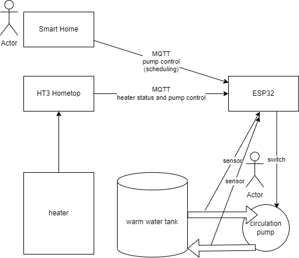
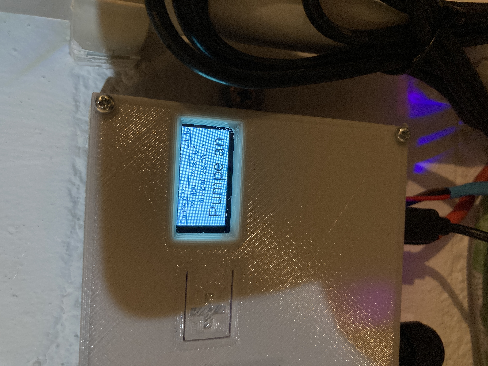

# Recirculation pump automated
How to optimize your water heating with an ESP32.

The project follows the ideas of https://github.com/MakeMagazinDE/Zirkulationspumpensteuerung and http://www.kabza.de/MyHome/CircPump/CirculationPump.php to control the hot water recirculation pump (Warmwasserzirkulationspumpe) via two temperature sensors comparing the warm water flow and return temperature. This saves electricity and thermal energy as the circulation will by done on request and not countinuously.

In the HT3 warm water diagram you see the period without warm water taking is flattend so the heater does heatup fewer.

## Featurelist
* Managing the pump via flow and return temperature
* MQTT publishing to get logging information
* MQTT subscription for your smart home and to use heater information like provided by https://github.com/norberts1/hometop_HT3
* Realtime clock for desinfection and logging
* SSD1306 OLED to view status information
* Guided setup to avoid storing WiFi password, etc. in the code
* 2 channel relay to add e.g. a magnetic vent later

## [Hardware](docs/schema.pdf)
* Wemos D1 Mini ESP32
* Standard Arduino/Raspberry 2-channel relay with optokoppler
* [BOM](docs/HotWaterRecirculatingPump.csv)
* STL for [case](docs/Warmwasserpumpe.stl) and [cover](docs/Warmwasserpumpe(2).stl)

## Mounting
The flow sensor have to be mounted 50cm away from the hot water reserviour. The return sensor near the end of the return pipe but not side by side to the reserviour. 

# Software
On first start the thing will open an Access Point named "Zirkulationspumpe" to provide the setup interface. The interface is still available after the device is connected so you can change everything later. But at first the firmware has to be uploaded. You can compile your own version or use the firmware provided in the releases.

1. Do the system configuration and set things name (hostname), AP password (if WiFi connection is lost) and WiFi credentials for your network.
2. MQTT configuration (optional)
   1. publish the following topics (folder structure can be changed):
      * "ww/ht/dhw_Tflow_measured": out temperature of the warm water
      * "ww/ht/dhw_Treturn": return temperture of the warm water circulation
      * "ww/ht/Tint": system internal temperture
      * "ww/ht/dhw_pump_circulation": pump is running or not
      * "ww/ht/info": system information as text
   2. subscribe for heater topics to block pump if heater is off (e.g. ht3/hometop/ht/hc1_Tniveau) and additional external pump trigger (e.g. ht3/hometop/ht/dhw_pump_circulation) to use the heaters pump messages -not set as default as it will then start the pump more often- from hometop_HT3 or something smarter provided by your smart home. The events will be triggered if the message contains the value set in the configuration.
4. NTP configuration to get RTC infos for logging (default is fine for german timezone)
5. Temperature configuration to map DS18B20 sensors detected
6. Define your return temperature to switch off when the water is gone through the whole circulation pipe.
7. Hold button for testing the relay/pump.

## OLED infos

# Tips
* Increase the pumps flow to the maximum that the water goes through the pipes as fast as possible.
* Setup special schedules via a smart home (MQTT) if you like to have warm water on request (e.g. by phone) or at a specific time.
* second relay channel is actually unused - suggest how to use it if you need